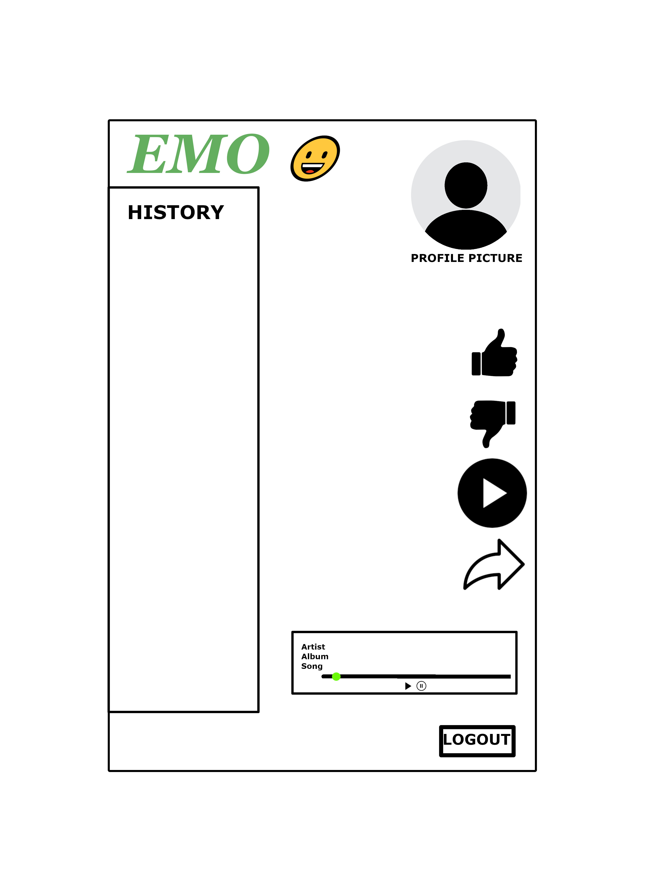

  

# Title: EMO -  Music Application

## Description
---

Imagine you're feeling upset about something and want to uplift your spirit, EMO is the app that can do that. You open the application, choose what emotion you currently feel and how you want to feel from a list of emojis, and then the application chooses a genre, artist and song tailored to your profile preference, and "voila!" you're on to a better, more cheerful day.

## User Story
---

As a music listener who might be in a less than ideal mood, I want an app that will provide me with music that is tailored specifically to me, which is determined by a series of user-specific questions aimed at deciphering my current mood along with deciphering the mood I intend to feel after the experince so that I can use the app to actively alter my mood.

## Acceptance Criteria 
---

>1. It is done when a user gets to create an account & set up a profile based upon preliminary questions.
>2. It is done when a user creates a custom channel. 
>3. It is done when a user can dynamically change their custom channel with a given mood (with their emotion). 
>4. It is done when a user can rate or react to different songs with emojis. 

## Wireframe
---

## APIs
---

Deezer

## Tasks
---

Michael Cosand: APIs, emojis, functionality, presentation slides.

Heather Serrano: account creation/user login with sequelize, edited and added content to readme, css.

Emmanuel Nwabueze: wireframe, html, css, created main branch with readme.

Jacob Brown: Trello, Figma, partial handlebar for dropdown menu, css.

## Deployment Link
---

